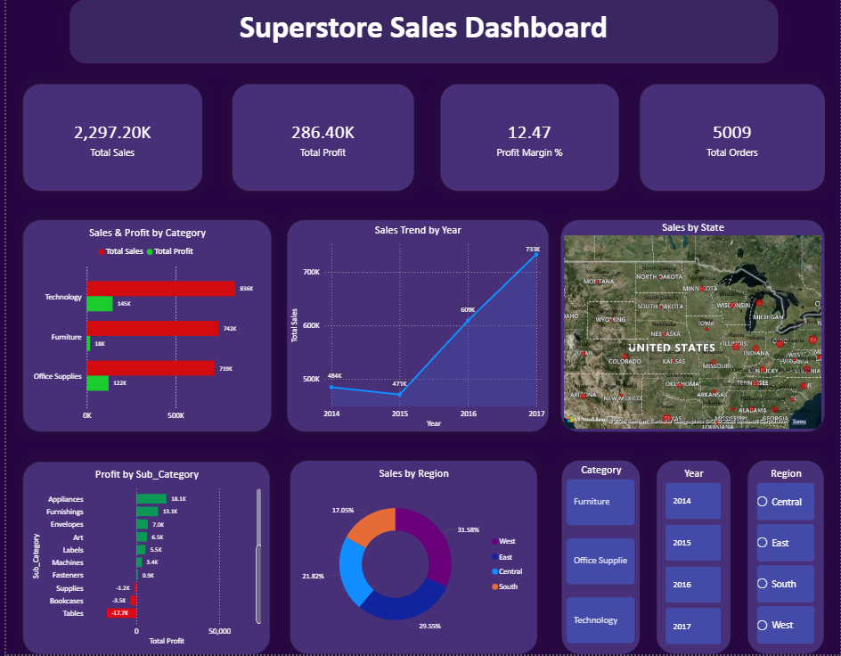

# Superstore Sales Analysis

An end-to-end data analysis project on 4 years of US retail data to uncover sales trends, profitability drivers, and business insights.

---

## Tools Used

| Tool | Purpose |
|---|---|
| Python (Pandas, Matplotlib, Seaborn) | Data cleaning, EDA, visualizations |
| PostgreSQL / pgAdmin | Business queries and advanced SQL analysis |
| Excel | Pivot tables and summary dashboard |
| Tableau | Interactive visual dashboard |
| Jupyter Notebook | Analysis environment |

---

## Project Structure

```
superstore-analysis/
├── data/               # Cleaned dataset
├── notebooks/          # Jupyter notebooks (cleaning, EDA, visualizations)
├── sql/                # SQL scripts (business queries, advanced analysis)
├── Excel/              # Excel pivot table dashboard
├── dashboard/          # Tableau workbook
├── exports/            # Saved charts and screenshots
└── README.md
```

---

## Key Questions Answered

- Which categories and regions drive the most revenue and profit?
- How does discounting impact profitability?
- Which products and sub-categories are loss-making?
- What does the sales trend look like year over year?
- Which customer segments are most valuable?

---

## Key Findings

- **Technology** generates the highest sales across all categories
- **Discounts above 40%** consistently result in losses regardless of category
- **Tables and Bookcases** are the top loss-making sub-categories
- The **West region** leads in both sales and profit
- Sales show a consistent upward trend with spikes every Q4

---

## Dashboard Preview



---

## How to Run

1. Clone this repo
2. Install dependencies: `pip install pandas matplotlib seaborn.`
3. Run notebooks in order: `01_data_cleaning` → `02_eda_analysis` → `03_visualizations`
4. Open SQL scripts in pgAdmin against a PostgreSQL database
5. Open the Tableau workbook to explore the interactive dashboard

---

## Contact

[Mansi Tamta] | [https://www.linkedin.com/in/mansi-tamta] | [mansi41997@gmail.com]

[Your Name] | [LinkedIn] | [Email]
